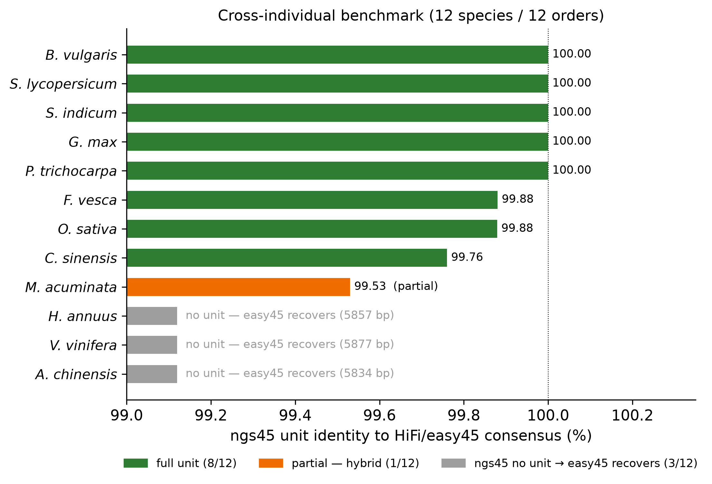
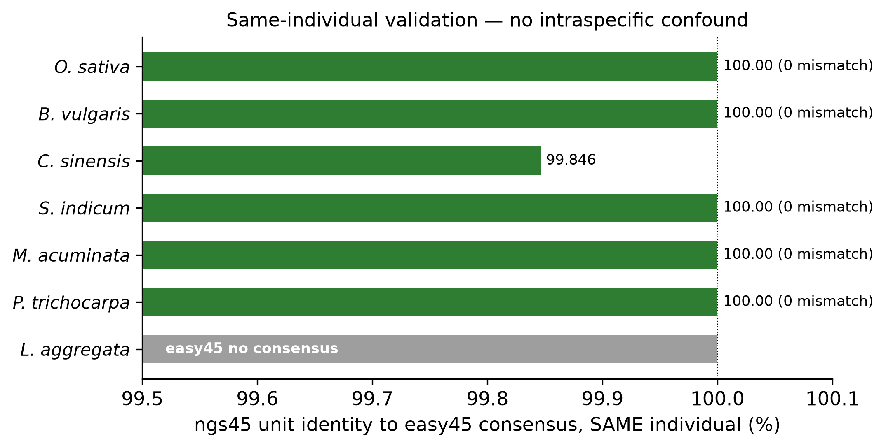
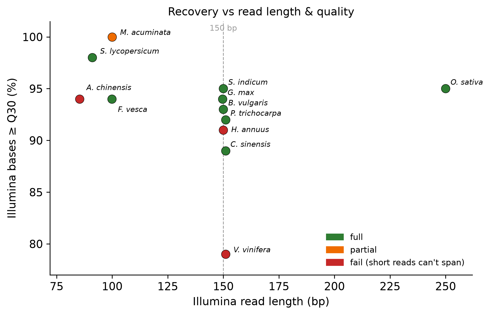
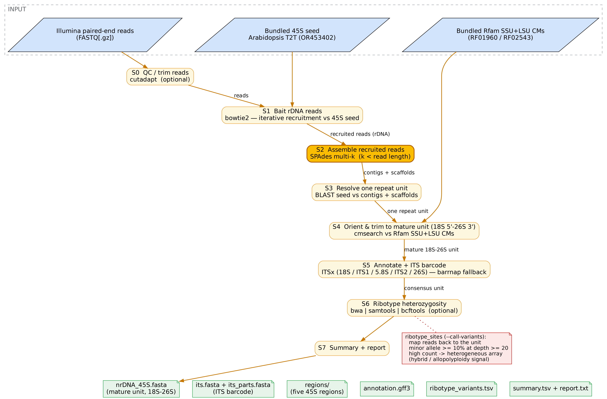

# ngs45 benchmark — figures

Generated by [`../bench/make_figures.py`](../bench/make_figures.py) from
[`../bench/master.tsv`](../bench/master.tsv) and
[`../bench/results_v3.tsv`](../bench/results_v3.tsv) (built by
[`../bench/consolidate.py`](../bench/consolidate.py)). PNG (300 dpi) + SVG + PDF in
[`../bench/figures/`](../bench/figures/). Full numbers: [BENCHMARK.md](BENCHMARK.md).

### Figure 1 — Cross-individual concordance

ngs45 unit identity to the HiFi/easy45 consensus, 12 species / 12 orders (Illumina
and HiFi from different individuals). Green = full unit (8/12, 99.76–100 %); orange =
partial (*Musa*, hybrid); grey = ngs45 produced no unit and easy45 recovers it
(*Helianthus*, *Vitis*, and *Actinidia* — the latter only because its cross-individual
library is 85 bp; see Fig 3). Where ngs45 assembles a unit it is near-identical to the
independent HiFi consensus.

### Figure 2 — Same-individual validation *(the rigorous result)*

HiFi + Illumina from the **same BioSample**, so identity reflects method only, not
intraspecific variation. 5/7 species are base-identical (0 mismatch), *Citrus*
99.85 %; *Lindera* is grey because easy45's HiFi subset was too sparse to call a
consensus (ngs45 still recovered the unit). This removes the cross-individual
confound: on the same plant, ngs45 ≡ easy45.

### Figure 3 — Recovery vs read length & quality

Illumina read length × %≥Q30, coloured by ngs45 outcome. Failures (red) occur both at
85 bp (*Actinidia*) and at 150 bp (*Helianthus*, *Vitis*), while short-but-clean
libraries succeed (*Solanum* 91 bp, *Fragaria* 100 bp) — so read length and quality
alone do not separate success from failure. Read length ≥150 bp is **necessary but
not sufficient**: *Actinidia* recovers the full unit once given a 150 bp library
(99.93 %), but divergent-spacer taxa (*Helianthus*, *Vitis*) still need HiFi.

### Pipeline overview

The eight-stage ngs45 workflow (S0/S6 optional), drawn in the same Graphviz style as
easy45. Source: [`pipeline.dot`](pipeline.dot) → `dot -Tpng -Gdpi=300 pipeline.dot`;
vector at [`pipeline.svg`](pipeline.svg).
