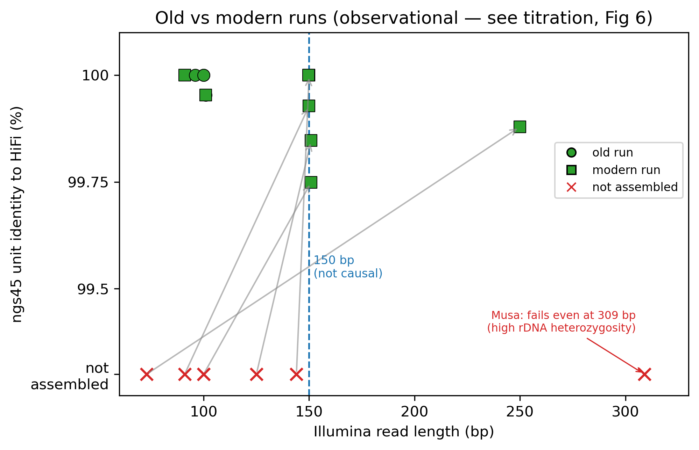
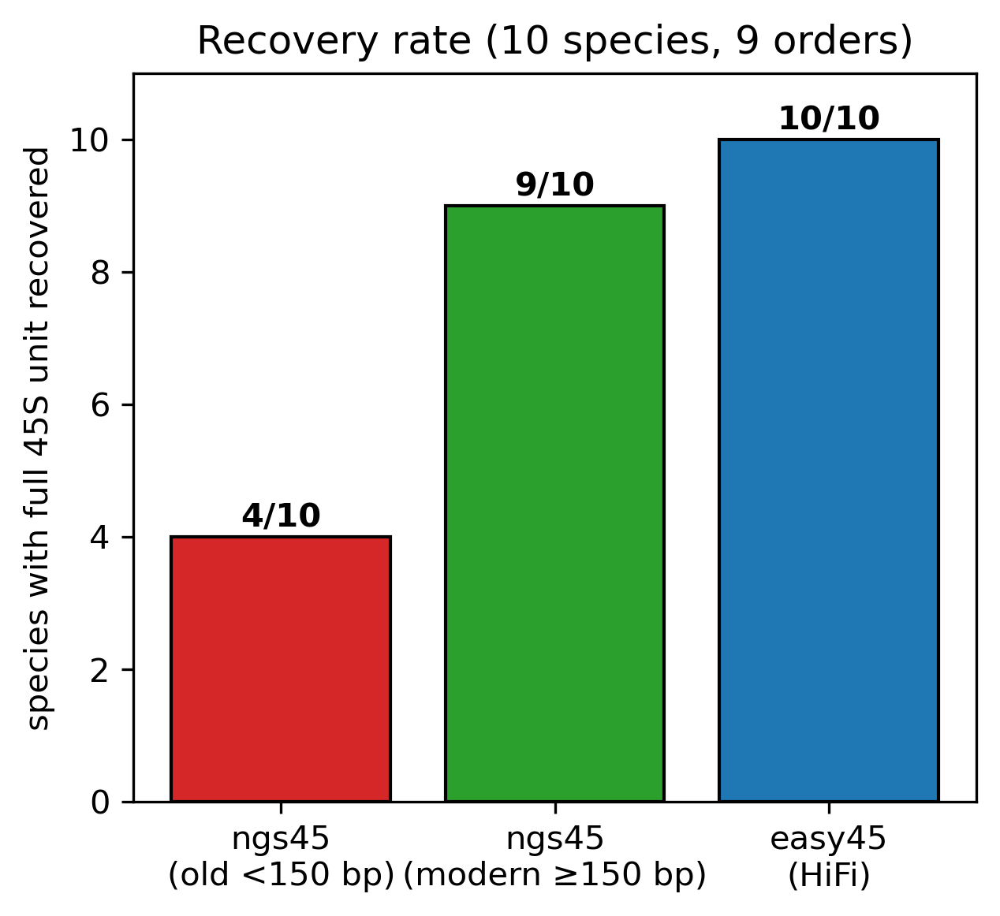
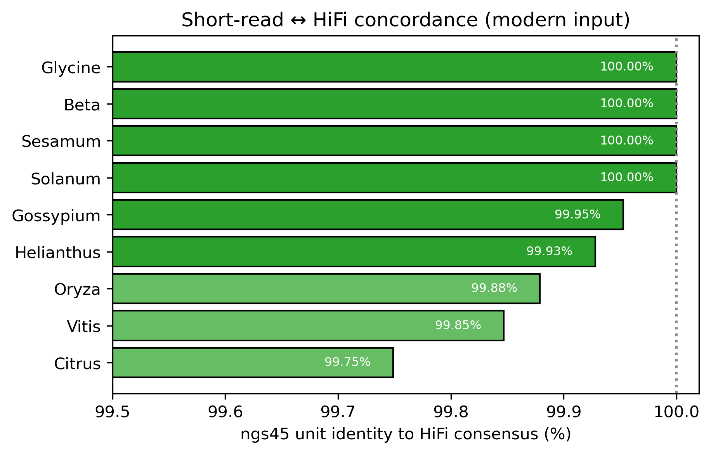
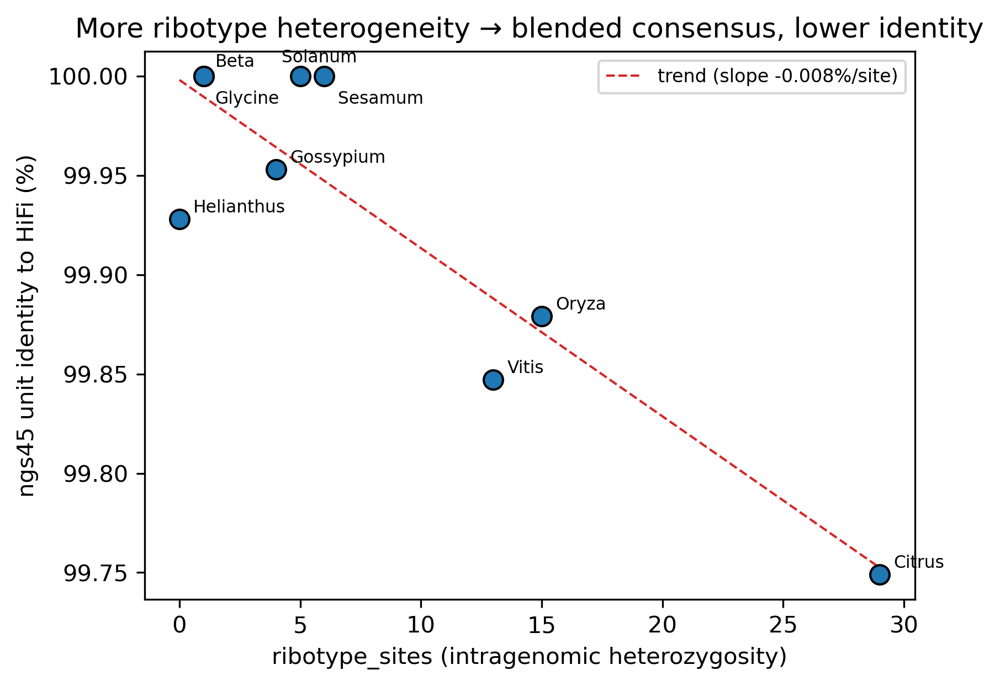
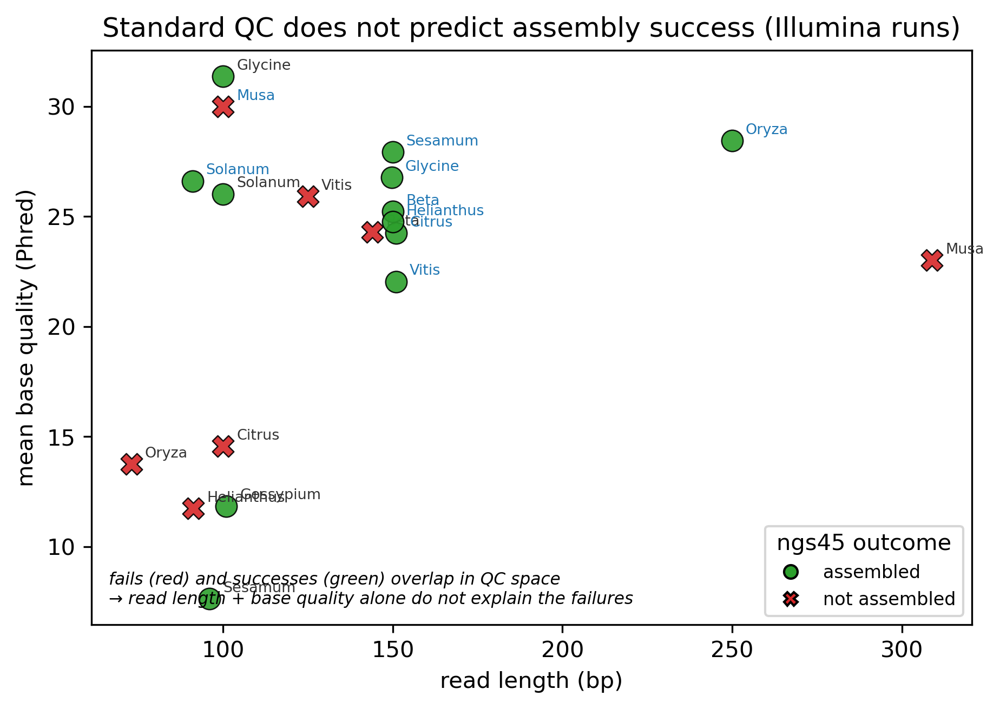
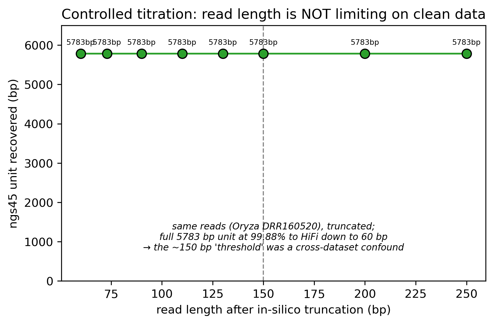
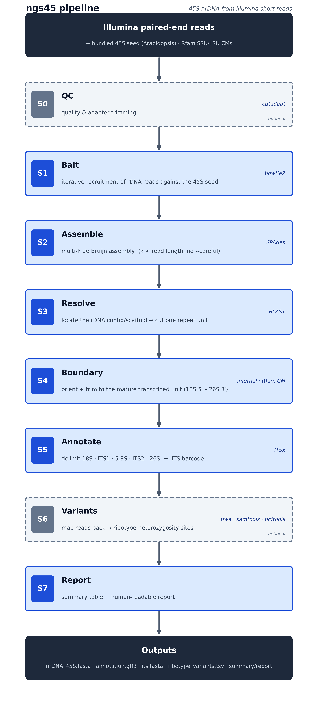

# ngs45 benchmark — figures

Generated by [`bench/make_figures.py`](../bench/make_figures.py) from
[`bench/results_summary.tsv`](../bench/results_summary.tsv),
[`bench/qc_all_datasets.tsv`](../bench/qc_all_datasets.tsv) and
[`bench/trunc_titration.tsv`](../bench/trunc_titration.tsv). PNG (300 dpi) + SVG in
[`figures/`](figures/). Numbers: [RESULTS_TABLE](../bench/RESULTS_TABLE.md).

> ⚠️ **Read Figures 5–6 before drawing causal conclusions from 1–2.** The
> read-length reading of Figures 1–2 is a **cross-dataset confound**: a controlled
> titration (Fig 6) shows ngs45 works down to 60 bp on clean data, and QC (Fig 5)
> shows length/quality do not separate the failures. Figures 1–2 are the
> *observation* that motivated the controlled tests, not proof that read length
> is causal.

### Figure 1 — old vs modern runs (observational; confounded)

ngs45 unit identity to the HiFi consensus vs Illumina read length. Green = full
unit recovered; red × = not assembled. Arrows link the *same species* from an old
run (fail) to a modern run (success). This *looked* like a ~150 bp threshold, but
the two runs also differ in error rate, coverage, individual and contamination —
so the causal claim does not hold (Figs 5–6). *Musa* fails even at 309 bp
(intrinsic rDNA heterozygosity; needs HiFi).

### Figure 2 — Recovery rate (old vs modern runs)

ngs45 recovered 4/10 units from the old public runs → **9/10 from modern runs**;
easy45/HiFi 10/10. The gain is real at the dataset level but is *not* attributable
to read length alone (see Fig 5–6).

### Figure 3 — Short-read ↔ HiFi concordance *(robust result)*

Where ngs45 succeeds, its unit is 99.75–100 % identical to the HiFi consensus
(several species 0 mismatches) — the core validation.

### Figure 4 — Ribotype heterozygosity lowers consensus identity *(robust result)*

Identity to HiFi vs `ribotype_sites`. Homogeneous arrays (0–6 sites) give a
0-mismatch consensus; heterozygous arrays (Citrus 29, Oryza 15, Vitis 13) give a
blended consensus at lower identity — biology (possible hybrid/allopolyploidy),
not an assembly error.

### Figure 5 — Standard QC does not predict success *(methodological result)*

Assembled (green) and failed (red) old-Illumina runs overlap completely in
(read length × base quality) space — e.g. *Sesamum* (mean Q 7.6) assembles,
*Beta*/*Vitis* (Q ~25) fail. QC alone neither explains nor predicts the outcome.

### Figure 6 — Controlled read-length titration *(the causal result)*

One clean run (*Oryza* DRR160520) truncated in-silico to 250→60 bp — everything
else held constant. ngs45 recovers the identical 5783 bp unit at 99.88 % to HiFi
at **every** length down to 60 bp ⇒ **read length is not the limiting factor**; the
apparent threshold in Fig 1 was a cross-dataset confound.

### Pipeline overview

The seven-stage ngs45 workflow (S0/S6 optional). Generated by
[`../bench/draw_pipeline.py`](../bench/draw_pipeline.py); vector source at
[`figures/pipeline.svg`](figures/pipeline.svg).
